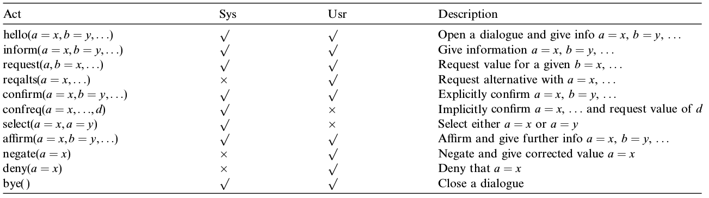

# 自然语言理解（NLU or SLU or LU）

这部分在有些资料被称为`SLU`(Spoken Language Understanding)，
有的资料也称为`NLU`(Natual Language Understanding)，甚至`LU`(Language Understanding)。
也有一些文献称之为`Semantic Decode`。

在基于帧（Frame）的对话系统设计中，
它的结果也被称为`Semantic Frame`，
也就是把用户输入的句子（utterance）转换为了一种Semantic Frame，即抽象出了用户所期望行为的语义。

这部分主要根据语音输入的结果，判断用户意图。

从含义角度来说，输出的是，三个部分内容：

SLOT(S): 问题所需要的数据参数

INTENT: 用户意图

DOMAIN: 意图领域


    注：用户意图这部分也被成为Dialogue Act Type，即对话行为类型

如 [Syntax or Semantics? Knowledge-Guided Joint Semantic Frame Parsing [Chen et al., 2016]](https://www.microsoft.com/en-us/research/publication/syntax-semantics-knowledge-guided-joint-semantic-frame-parsing/) 的例子：

```
W: tell vivian to be quiet
S: contact=vivian, message=be quiet
D: communication
I: send_text
```

也就是用户输入了`tell vivian to be quiet`之后，
或者这句话的DOMAIN（D）是`communication`，
INTENT是`send_text`，
有两个slot，
分别是联系人`contact=vivian`还有信息内容`message=be quiet`

从LU中完整解析出的内容，即包括Domain、Intent、Slots，我们可以把这些结果统称为从句子中解析的User Action。

---

从一些实际应用的角度来说，这部分LU在一些系统里也被描述为会产生潜在的`user-action`候选列表。也就是“用户想做什么”的行为列表和每种行为的可能性

例如用户输入：“明天晚上的电影”，结果可能是：

```
[
    {
        "user_action": "request(movie_name, date=tomorrow_night)",
        "score": 0.5
    },
    {
        "user_action": "request(movie_name, date=tomorrow)",
        "score": 0.3
    },
    {
        "user_action": "inform(date=tomorrow_night)",
        "score": 0.1
    }
]
```

这个的意思是，NLU可能输出的不是“一个”用户行为，而是用户行为可能性的分布，或者可以理解为多个可能性以及它们的置信度。

## 语义理解，是一句话的事儿

首先我们要明确，在绝大多数对话系统设计中，所谓用户行为，是单指一句话的内容，绝对不包括系统上下文，但是可能包括系统本身的性质。

这个怎么理解呢，我们看下面两段对话：

对话1：

- 系统：你好，航空购票系统为您服务，请问定什么时候的机票？
- 用户：明天晚上的

对话2：

- 系统：你好，电影服务系统，请问查询什么时候的电影院信息？
- 用户：明天晚上的

在上面的两段对话中，语言理解做的是对“用户”所说的话的理解，如果我们掺杂了上下文，在这里可以认为是指上文的系统的话，那么一些开发人员或者标注人员可能会对用户所说的话作出截然不同的标注，例如第一段对话标注为`购票（时间=明天晚上）`，第二段对话标注为`找电影（时间=明天晚上）`

这种方式实际是与传统的LU任务相违背的，因为它把完全相同的一句话标注成了不同的意思。在传统的LU任务中这句话应该标注为`inform(时间=明天晚上)`，即用户只是在告诉系统明天晚上这个时间而已。

那么会有人问了，假设这两个段对话在同一个系统，例如它是一个又可以订机票又可以买电影票的系统，到底怎么区分到底用户相干什么，这样不是乱的了吗？

实际上并不会，因为在Pipeline里面，关于上下文信息的内容其实是包含在对话策略模块的，如果写作函数的话，我们可以认为是：

```math
用户行为 = NLU（当前用户的发言）
历史状态t+1 = DST（历史状态t，用户行为）
系统行为 = DPL（历史状态t+1）
```

这里的历史状态是对话状态在时间上的合集，而对话状态包括用户的发言和行为、系统的行为、系统中保存的对话状态表示（类似一种记忆）

即：DST和DPL作为对话管理（DM）在产生作用的时候，会利用到历史上下文信息，所以并不需要LU也同时根据上下文信息做出响应。

现在还有两个问题：

1. 你说传统的对话系统都不会让LU包含上下文，有没有包含上下文呢的系统？

首先是有的，例如
Nearly Zero-Shot Learning for Semantic Decoding in Spoken DialogueSystems
[Rojas-Barahona et al., 2018]
中就作出了这样的设计。所以这种方法可能在特定的环境下对系统更有利

2. 那不让LU读取上下文信息，对系统有好处吗？

这个也是有的，但是好处可能主要不在系统本身，而是在开发成本上。考虑两个成本：

1. 设计根据上下文的多种语义理解增加了用户行为的定义，也就是在对话流程设计上会更复杂
2. 需要标注人员根据上下文标注，而无法做到一条句子一条句子这样的标注，增加了标注成本（阅读理解 vs 选择题）
3. 使对话行为复用更困难，需要更多的标注
4. 模型从`P(用户行为|用户对话)`，变成了`P(用户行为|用户对话，上下文)`，本身需要更强的模型能力

---

刚才还说了，对话是可以根据系统的定义来改变的，这又是为什么呢。

本质上来说我们很难作出一个大而全完美的系统，所以如果系统只做一件事，我们完全可以把句子按照系统能理解的方法理解。例如系统只能购买火车票，但是用户的对话是：“我要买去北京的机票”，那么系统有两个选择：

1. 提醒用户系统只能买火车票
2. 不理解机票两个字，还是按照火车票的流程走，买了去北京的火车票。

如果我们能做到1.，那么会让系统显得很智能，但是在大多数情况其实不必要的，或者说很难做到的。因为系统知道自己能做到很简单，但是知道自己做不到很难，人可以通过各种推理、常识去思考，但是机器不会。

可能会觉得识别是不是机票这件事儿很简单，但是实际上“坐飞机”这件事儿的描述方法会比我们想象的多，例如：

- 去北京，最快的方法
- 飞去北京
- 去北京机场
- 去北京，飞机火车都行

前三句没有“飞机”两个字，但是可能是指飞机，最后一句有“飞机”两个字，但是可能无所谓。

所以大部分时候系统只要在能力范围内做到自己能做到的事情就好，只要不断的提醒用户：“我就是只能订火车票”。

## 用户行为和系统行为样例

这些列表可能类似下面的行为，其中`Usr`列打对号的就是用户可能产生的行为列表，我们以后会在单独的`NLU`相关章节详细探讨这部分内容。




The Hidden Information State model: A practical framework for POMDP-based spoken dialogue management
[Young et al., 2010]
