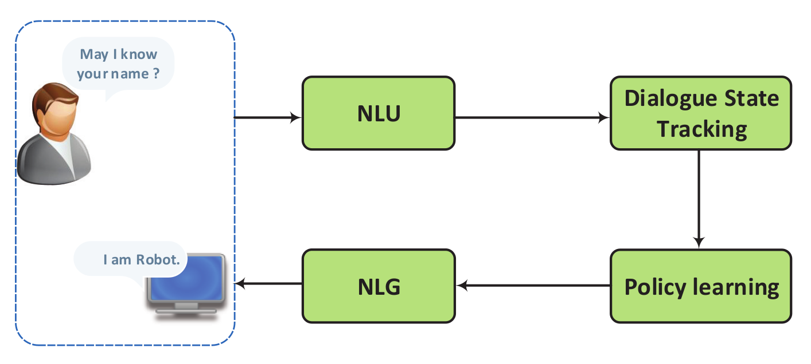

# DeepDialog

- [论文](PAPERS.md)
- [数据](DATA.md)
- [QAS](QAS.md)
- [CHAT](CHAT.md)

## 简介

一些关于对话系统（Dialogue System），尤其是面向任务的对话系统（Task-Oriented Dialogue System）的设计、讲解或者论文中，我们经常会看到类似：自然语言理解（NLU）、对话管理（DM）、对话生成（NLG），这样的Pipeline。



图1：一个典型的对话系统结构
A Survey on Dialogue Systems: Recent Advances and New Frontiers
[Chen et al., 2014]

也会看到包括问答系统（Question Answering）、聊天机器人（Chatbot）等实现和结构。同时也可以了解到这些各个部件从早期研究基于规则的做法，到基于传统机器学习、直到现在基于深度学习，甚至强化学习如何训练的发展过程。

那么从系统实现来看，到底这样的系统内部是什么样的。以学术论文和最新研究为引导，拆开粗糙的系统架构图，进入到每个接口、每个模块、甚至每个模型，这样的对话系统到底是什么样子。我会讲解一个简易但基本可用的开源对话系统框架，它是一个完全由深度学习算法、完全基于数据驱动的对话系统实现，在这个过程中深入简介它其中的原理。

在这个系统中，我们会看到如何使用Keras来实现对话系统的各个组件，包括四个深度学习模型：意图及领域分析、实体识别、对话状态跟踪以及对话决策。以及如何用、用什么样的训练数据将这些组件串成一个完整可用的对话系统。

## 一个完整系统什么样

这里介绍整体Pipeline和每个组件的输入输出的语义以及接口

一个完整的系统也确实如图所示，是由语言理解，状态跟踪，策略学习，对话生成这些模块组成的。这些模块本质上是为了解决完整的对话系统问题，而拆解出的一个个子模块，这些模块的串联，组成了整个对话系统的Pipeline。

- [NLU](NLU.md)
- [DST](DST.md)
- [DPL](DPL.md)
- [NLG](NLG.md)

## 用程序实现

这里介绍接口和模型的详细实现。

这里我们用python的类来实现每个部件的接口，其中每个接口最重要的方法是forward，可以认为是一个一个pipeline直接传递的东西。

例如我们假设我们构建了各个部件的类：

```python
nlu = NLU()
dst = DST()
dpl = DPL()
nlg = NLG()

# utterance是用户输入的文字
# 那么我们有

def bot_pipeline(utterance)
    x = nlu.forward(x)
    x = dst.forward(x)
    x = dpl.forward(x)
    x = nlg.forward(x)
    return x  # 这里的x已经是系统输出的文字了
```

### NLU

输入一句用户的自然语句(utterance)，输出对应的Domain，Intent，Slots

```python
class NaturalLanguageUnderstanding(object):
    def forward(self, utterance: str) -> UserAction:
        user_action = UserAction()
        # 处理逻辑
        return user_action
```

### DST

对话状态更新模块

输入一个当前对话状态和NLU的输出，输出一个新的对话状态

```python
class DialogStateTracker(object):
    def forward(self,
                init_state: DialogState,
                history: List[DialogState],
                user_action: UserAction) -> DialogState:
        new_ds = DialogState()
        return new_ds
```

DST的主要问题是如何更新当前对话状态

### Dialog Policy

对话决策模块

输入一个当前对话状态，输出一个系统行为

```python
class DialogPolicy(object):
    def forward(self,
                history: List[DialogState]) -> SystemAction:
        system_action = SystemAction()
        return system_action
```

根据当前的DialogState要列出潜在是system action列表这个列表里面的action如果是基于system call的，还需要获取对应的程序返回结果，这个结果也要融合到决策过程里面

### NLG

输入一个系统行为和参数，输出一个自然语句

```python
class NLG(object):
    def forward(self, system_action: SystemAction):
        system_response = SystemResponse()
        return system_response
```


## 数据在哪？

这里介绍如果标注、产生数据，以及如何使用这些数据训练各个组件

### NLU-Label介绍

标记NLU数据

### 标记故事线数据

Stories

## 它还欠缺什么

从系统的角度阐述一个完整的对话系统应该包含什么，这套系统为什么不能是完全工业可用的系统，还需要做到什么。
